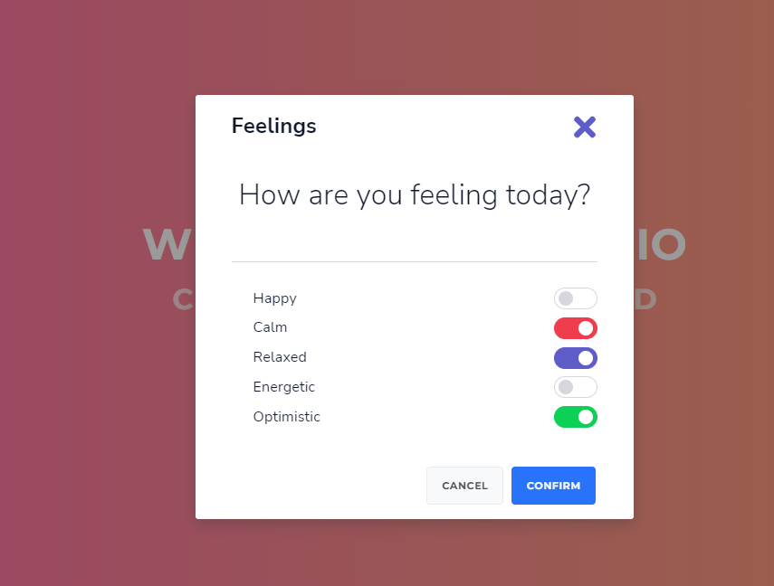
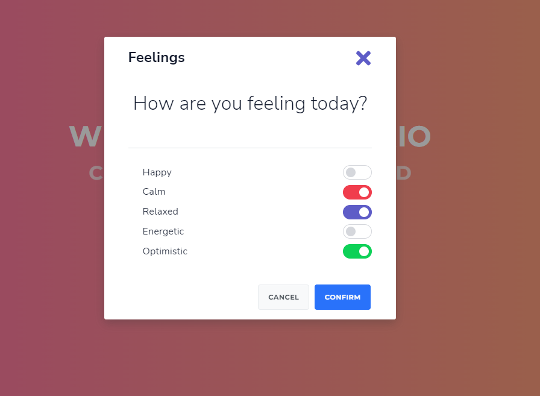

# **Cheerio**

## Description

* Cheerio is a web application that allows users to feel both motivated and inspired through inspirational quotes and visuals. Our web application best captivates users who are looking for words that will represent how they are feeling at that current moment. Cheerio allows users to input how they are currently feeling whether that be calm, optimistic, relaxed, etc and formulates randomized quotes and backgrounds that better captures and materializes into words what a user might be feeling at that time.

Click the link below to visit our live site: 

[ Cheerio 🤗](https://daevidvo.github.io/Cheerio/)

## **Technology Used**

| Technology Used         | Resource URL           | 
| ------------- |:-------------:| 
| HTML    | [https://developer.mozilla.org/en-US/docs/Web/HTML](https://developer.mozilla.org/en-US/docs/Web/HTML)|  
| CSS     | [https://developer.mozilla.org/en-US/docs/Web/CSS](https://developer.mozilla.org/en-US/docs/Web/CSS)      |   
| Git | [https://git-scm.com/](https://git-scm.com/)     |    
| JavaScript  | [https://developer.mozilla.org/en-US/docs/Web/JavaScript](https://developer.mozilla.org/en-US/docs/Web/JavaScript)     |  
|Font Awesome|[https://fontawesome.com/](https://fontawesome.com/)|
|Google Fonts|[https://fonts.google.com/](https://fonts.google.com/)|
|Cirrus|[https://cirrus-ui.netlify.app/getting-started/setup](https://cirrus-ui.netlify.app/getting-started/setup)|
|jQuery|[https://jquery.com/](https://jquery.com/)|
|Anime.js|[https://animejs.com/](https://animejs.com/)|

## **User Stories**

As a user I want to be able to feel inspired and motivated so that I am able to feel energized and ready to take on the world each day.

As a user I want to see inspirational quotes and images when I input my mood, so that I feel that my emotions are materialized in front of me.

[]()

## Code Learning Points

* Using third-party CSS frameworks allowed us to really get started on our MVP. Through utilizing Cirrus as our CSS framework and parsing through the documentation, we were able to create dynamic and stylish elements in our HTML without the need for external or custom CSS. This was a choice made by our team because we liked the built-in look that came with Cirrus. 

```html 
        <div class="header-nav" id="header-menu"> <!--navbar on desktop-->
            <div class="nav-right">
                <div class="nav-item text-center">
                    <a href="https://github.com/daevidvo/Cheerio"> <!--github repo link-->
                        <span class="icon">
                            <i class="fab fa-wrapper fa-github" aria-hidden="true"></i> <!--github icon from font awesome-->
                        </span>
                    </a>
                </div>

                <div class="nav-item has-sub toggle-hover" id="dropdown"> <!--dropdown menu for navbar-->
                    <a class="nav-dropdown-link">More Links</a>
                    <ul class="dropdown-menu dropdown-animated" role="menu"> <!--navbar animation from cirrus-->
                        <li role="menu-item"><a href="./aboutus.html">About Us</a></li>
                        <li role="menu-item"><a href="https://www.youtube.com/watch?v=dQw4w9WgXcQ&pp=ygUJcmljayByb2xs">Surprise :)</a></li>
                    </ul>
                </div>
            </div>
        </div>
```
 
* A vital part to the functionality of Cheerio is the usage of server-side API calls and utilizing third-party information to help in the creation of our application. Below, you can see an example of a function that executes an API call. Through utilizing the variablemood variable, we were able to get a random picture based on the user's mood and change the wallpaper of the site accordingly.

```JavaScript
//Unsplash API Call
function getUnsplash(variablemood){
  let clientID = "5EBER4yF6LOq05pKyvvFhc3yQkLyidB-RSL4FRW0a3c";
  let endpoint = "https://api.unsplash.com/photos/random/?query=" + variablemood + "&client_id=" + clientID;

  let imageEl = document.querySelector("#splash-img");
//fetch function
  fetch(endpoint)
    .then(function (response) {
      return response.json();
    })
    .then(function(jsonData) {
      imageEl.setAttribute('style', `background-image: url(${jsonData.urls.regular})`)
    })
}
```


## **Usage**

Click the link below: 

[ Cheerio 🤗](https://daevidvo.github.io/Cheerio/index.html)

Here you can see the home page of Cheerio:
<br>
[]()

Here you can see a screenshot of what a user might select when inputting moods:
<br>
[]()

Here you can see a screenshot of how the Stoic API and Unsplash API work together to allow users to see randomized quotes and images based on their mood inputs:
<br>
[]()

After refreshing the site user inputs are saved as seen below:
<br>
[]()

Here you can see our about us page:
<br>
[]()


## **Cirrus**
Cirrus is a modular, responsive, and component centric SCSS framework aimed at bringing not only beautiful, hassle-free styling, but also a better developer experience. Almost all generated styles can be modified via its config style so you can mold the framework to whatever you want.

🎁 Construct your web app or website by composing beautifully designed components.
🛠 Shipped with utility classes to design with scale.
📱 Fully responsive by design.
🎨 Almost fully customizable styles and classes.
⚡ The only file you need is the minified CSS file from a CDN.
🌌 Fully open source.

Here you can see a display of Cheerio in different screen sizes:
<br>
[]()

Link to Cirrus documentation: [https://cirrus-ui.netlify.app/docs](https://cirrus-ui.netlify.app/docs)


## **Authors**

 ### David Vo

- [Link to Github](https://github.com/daevidvo)
- [Link to LinkedIn](https://www.linkedin.com/in/daevidvo/)

 ### Bryan Nguyen

- [Link to Github](https://github.com/bryannguyen9)
- [Link to LinkedIn](https://www.linkedin.com/in/bryannguyen9/)

 ### Kenneth
- [Link to Github](https://github.com/cruzkenneth504)
- [Link to LinkedIn](linkedin.com/in/cruzkenneth504)


## **Acknowledgments**

* [Cirrus Documentation](https://cirrus-ui.netlify.app/docs)
* [Java Script Documentation](https://devdocs.io/javascript/)
* [Anime.js Documentation](https://animejs.com/documentation/)
* [jQuery Documentation](https://api.jquery.com/)


## **License**

MIT License

Copyright (c) [2023] [Bryan-Nguyen]

Permission is hereby granted, free of charge, to any person obtaining a copy
of this software and associated documentation files (the "Software"), to deal
in the Software without restriction, including without limitation the rights
to use, copy, modify, merge, publish, distribute, sublicense, and/or sell
copies of the Software, and to permit persons to whom the Software is
furnished to do so, subject to the following conditions:

The above copyright notice and this permission notice shall be included in all
copies or substantial portions of the Software.

THE SOFTWARE IS PROVIDED "AS IS", WITHOUT WARRANTY OF ANY KIND, EXPRESS OR
IMPLIED, INCLUDING BUT NOT LIMITED TO THE WARRANTIES OF MERCHANTABILITY,
FITNESS FOR A PARTICULAR PURPOSE AND NONINFRINGEMENT. IN NO EVENT SHALL THE
AUTHORS OR COPYRIGHT HOLDERS BE LIABLE FOR ANY CLAIM, DAMAGES OR OTHER
LIABILITY, WHETHER IN AN ACTION OF CONTRACT, TORT OR OTHERWISE, ARISING FROM,
OUT OF OR IN CONNECTION WITH THE SOFTWARE OR THE USE OR OTHER DEALINGS IN THE
SOFTWARE.